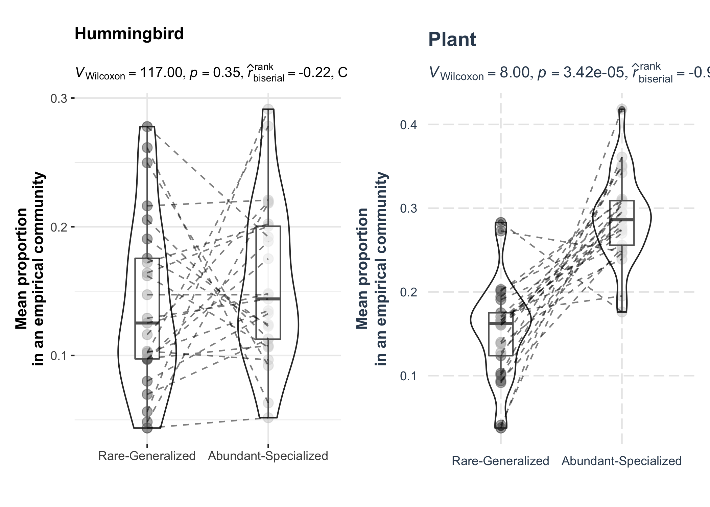

<!-- README.md is generated from README.Rmd. Please edit that file -->

The goal of this package is to reproduce the paper “Generalism drives
abundance: a computational causal discovery approach” by Chuliang Song,
Benno I. Simmons, Marie-Josée Fortin, and Andrew Gonzalez.

## Installation

You can install the package from GitHub with:

``` r
# install.packages("devtools")
devtools::install_github("clsong/ReproduceChickenEgg")
```

## Reproduce

The main figures can be reproduced simply by running
*plot_figure_Number*. For example, figure S9 can be reproduced as

``` r
library(ReproduceChickenEgg)
plot_figure_S9()
```


